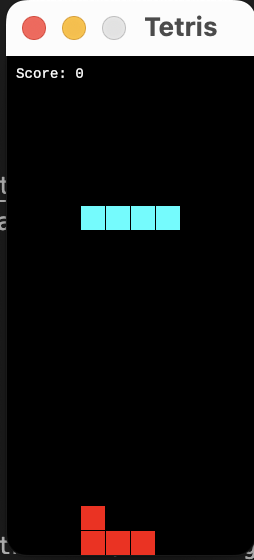

# Rust Tetris Game

A classic Tetris game implementation using Rust programming language and the GGEZ game engine.

## Screenshots



## Features

- 7 classic Tetris shapes
- Smooth block movement and rotation
- Automatic falling mechanism
- Scoring system
- Game state display

## Prerequisites

- Rust and Cargo (latest stable version recommended)
- Supported operating systems:
  - macOS
  - Linux
  - Windows

## Installation

1. Clone the repository:
```bash
git clone [your-repository-url]
cd rust_hello_world
```

2. Build and run the game:
```bash
cargo run
```

## Controls

- **↑ (Up Arrow)**: Rotate piece
- **← (Left Arrow)**: Move left
- **→ (Right Arrow)**: Move right
- **↓ (Down Arrow)**: Fast drop

## Game Rules

1. Blocks automatically fall from the top of the screen
2. Use arrow keys to move and rotate blocks
3. Complete lines are cleared and award points:
   - 1 line: 100 points
   - 2 lines: 300 points
   - 3 lines: 500 points
   - 4 lines: 800 points
4. Game ends when blocks stack up to the top

## Technical Details

- Built with Rust programming language
- Uses GGEZ game engine
- Core features implementation:
  - Collision detection
  - Block rotation algorithm
  - Automatic falling timer
  - Line clearing detection
  - Scoring system

## Project Structure

```
rust_hello_world/
├── src/
│   └── main.rs      # Main game code
├── Cargo.toml       # Project dependencies
└── README.md        # Project documentation
```

## Dependencies

- ggez = "0.9.3" - 2D game development framework
- rand = "0.8.5" - Random number generation

## Roadmap

- [ ] Add next piece preview
- [ ] Implement high score saving
- [ ] Add pause functionality
- [ ] Add background music and sound effects
- [ ] Add difficulty levels

## Contributing

Issues and Pull Requests are welcome! Feel free to contribute to improve the game.

## License

MIT License
